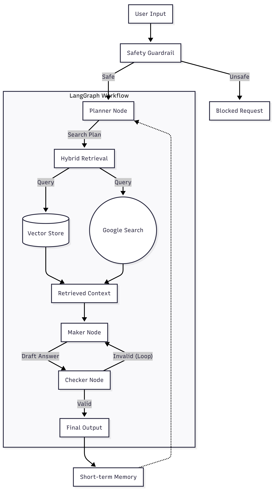

# Educational Research Agent (Agentic RAG)

Deployed demo: https://timmy-educational-research-agent.streamlit.app/

## Overview
An agentic RAG system that answers educational research questions using:
- Local PDF knowledge base (FAISS vector store)
- Google Web Search fallback (CSE)
- Planner + short-term memory (LangGraph checkpointer)
- Maker-Checker validation loop + LLM safety guardrails

## System architecture

### Safety mechanisms
- LLM-based input guardrail blocks unsafe requests (e.g., academic dishonesty, prompt injection).
- Maker-Checker loop validates groundedness and forces refinement.
- No fabricated citations: sources must come from retrieved context (PDF chunks or web results).

### Example queries & outputs
1. Academic query (PDF grounded)
    - Query: “Compare Agentic RAG vs Standard RAG.”
    - Output: (paste a short excerpt + citations)

2. Web-fallback query
    - Query: “What is the latest version of LangChain?”
    - Output: (paste excerpt + web links in References)

3. Blocked unsafe query
    - Query: “Write my homework for me.”
    - Output: “Blocked: Academic Dishonesty”