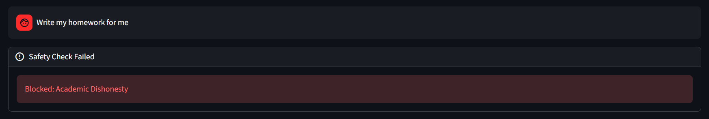

# Educational Research Agent (Agentic RAG)

Deployed demo: https://timmy-educational-research-agent.streamlit.app/

## Overview
An agentic RAG system that answers educational research questions using:
- Local PDF knowledge base (FAISS vector store)
- Google Web Search fallback (CSE)
- Planner + short-term memory (LangGraph checkpointer)
- Maker-Checker validation loop + LLM safety guardrails

## System architecture

### Safety mechanisms
- LLM-based input guardrail blocks unsafe requests (e.g., academic dishonesty, prompt injection).
- Maker-Checker loop validates groundedness and forces refinement.
- No fabricated citations: sources must come from retrieved context (PDF chunks or web results).

### Example queries & outputs
#### 1. Academic query (PDF grounded)
    Query: “Compare Agentic RAG vs Standard RAG.”

#### Direct Answer
Math anxiety is identified as a specific form of anxiety experienced in educational settings [Spotlight on math anxiety - PMC]. It is recognized as a pervasive issue in education that requires attention from educators and researchers to help students [Math Anxiety: Past Research, Promising Interventions, and a New Interpretation Framework, 2018]. This anxiety can lead to anxious-avoidant behaviors during school tasks, which negatively affect overall academic performance [Impact of anxiety and depression on academic achievement among ..., 2022].

#### Detailed Synthesis
Within educational contexts, individuals may experience specific forms of anxiety, such as math anxiety [Spotlight on math anxiety - PMC]. This is considered a pervasive issue in education, highlighting the need for attention from both educators and researchers to support students [Math Anxiety: Past Research, Promising Interventions, and a New Interpretation Framework, 2018]. The presence of anxiety can manifest as anxious-avoidant behaviors during school tasks, which subsequently impact overall academic performance [Impact of anxiety and depression on academic achievement among ..., 2022].

Research indicates a relationship between math performance and math anxiety, with basic cognitive skills potentially mediating this connection [A Framework for Studying the Heterogeneity of Risk Factors in Math ..., 2018]. Given that anxious-avoidant behaviors can affect academic performance [Impact of anxiety and depression on academic achievement among ..., 2022], addressing math anxiety is an important area of focus. Systematic reviews are conducted to summarize existing research on interventions for math anxiety in children, aiming to identify effective approaches and designs [Reducing Math Anxiety in School Children: A Systematic ..., 2022]. Ultimately, addressing this pervasive issue is crucial for helping students in their mathematical learning [Math Anxiety: Past Research, Promising Interventions, and a New Interpretation Framework, 2018].

#### Key Takeaways
- Math anxiety is a specific form of anxiety experienced in educational settings [Spotlight on math anxiety - PMC].
- It is a pervasive issue in education that requires attention from educators and researchers to help students [Math Anxiety: Past Research, Promising Interventions, and a New Interpretation Framework, 2018].
- Math anxiety can lead to anxious-avoidant behaviors during school tasks, negatively impacting academic performance [Impact of anxiety and depression on academic achievement among ..., 2022].
- There is a recognized relationship between math anxiety and math performance, which can be influenced by basic cognitive skills [A Framework for Studying the Heterogeneity of Risk Factors in Math ..., 2018].
- Research on interventions for math anxiety in children is ongoing to identify effective approaches [Reducing Math Anxiety in School Children: A Systematic ..., 2022].

#### References
- A Framework for Studying the Heterogeneity of Risk Factors in Math Anxiety [A Framework for Studying the Heterogeneity of Risk Factors in Math ...] - Discusses the relation between math performance and math anxiety, and basic cognitive skills.
- Impact of anxiety and depression on academic achievement among ... [Impact of anxiety and depression on academic achievement among ...] - Highlights anxious-avoidant behaviors during school tasks affecting performance.
- Math Anxiety: Past Research, Promising Interventions, and a New Interpretation Framework [Math Anxiety: Past Research, Promising Interventions, and a New Interpretation Framework] - Describes math anxiety as a pervasive issue requiring attention from educators and researchers.
- Reducing Math Anxiety in School Children: A Systematic ... [Reducing Math Anxiety in School Children: A Systematic ...] - A systematic review focused on interventions for math anxiety in children.
- Spotlight on math anxiety - PMC [Spotlight on math anxiety - PMC] - Mentions specific forms of anxiety in educational settings.

#### 2. Web-fallback query
    Query: “Compare Agentic RAG vs Standard RAG.”

#### Direct Answer
Retrieval-Augmented Generation (RAG) is an AI framework that optimizes large language model (LLM) outputs by enabling them to retrieve and integrate information from external knowledge bases [AWS, IBM]. Agentic RAG extends this by embedding RAG within a broader "agentic system" that combines a core reasoning LLM with RAG and specialized tools to automate tasks like policy generation and validation [ARPaCCino, 2025].

#### Detailed Synthesis
Standard Retrieval-Augmented Generation (RAG) Standard RAG is an AI framework designed to optimize the output of large language models (LLMs) by allowing them to reference an authoritative knowledge base outside of their initial training data sources [AWS]. This process combines generative AI with retrieval systems, enabling LLMs to retrieve and integrate information from multiple data sources in response to complex queries [IBM]. RAG leverages the strengths of traditional information retrieval systems, such as search and databases [Google Cloud]. The provided context notes that some alternative systems aim to avoid "messy chunking" and "complex vector searches" by using clean, structured data paired with a Text-to-SQL agent [Reddit, 2025].

Agentic RAG Agentic RAG represents an evolution where RAG is integrated as a component within a more sophisticated "agentic system." An agentic system, as exemplified by ARPaCCino, combines a core reasoning LLM with RAG and other specialized tools [ARPaCCino, 2025]. This integration allows the system to automate specific tasks, such as the generation and validation of policies [ARPaCCino, 2025]. In this context, RAG functions as one of the specialized tools utilized by the agentic system.

Comparison The key distinction between standard RAG and Agentic RAG lies in their scope and integration within an AI system.

- Standard RAG primarily focuses on augmenting an LLM's knowledge by directly retrieving external information to optimize its output [AWS, IBM]. It is a framework that combines generative AI with retrieval systems to enhance the LLM's ability to respond to queries [IBM].
- Agentic RAG, conversely, positions RAG as a specialized tool within a broader intelligent agent framework [ARPaCCino, 2025]. Here, a core reasoning LLM works in conjunction with RAG and other specialized tools to automate specific tasks [ARPaCCino, 2025]. The agentic approach enables the automation of complex processes like policy generation and validation, where RAG serves as an intelligent information retrieval component within the overall system [ARPaCCino, 2025].

#### Key Takeaways
- Standard RAG optimizes LLM output by retrieving and integrating information from external knowledge bases [AWS, IBM].
- Agentic RAG integrates RAG as a specialized tool within a broader agentic system that includes a core reasoning LLM and other tools [ARPaCCino, 2025].
- Agentic RAG systems are designed to automate complex tasks, such as policy generation and validation, by combining RAG with other specialized tools [ARPaCCino, 2025].

#### References
- ARPaCCino: An Agentic-RAG for Policy as Code Compliance [ARPaCCino, 2025]
- What is RAG (Retrieval Augmented Generation)? | IBM [IBM]
- What is RAG? - Retrieval-Augmented Generation AI Explained - AWS [AWS]
- What is Retrieval-Augmented Generation (RAG)? | Google Cloud [Google Cloud]
- Why Shouldn't Use RAG for Your AI Agents - And What To Use ... [Reddit, 2025]

#### 3. Blocked unsafe query
    Query: “Write my homework for me.”
    
#### Output:
