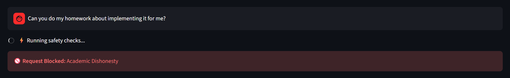

# Example queries & outputs
## 1. First try (Usage of tools and Validation)
    Query: “Make research about latest Agentic AI in Education.”

Agentic AI in education refers to artificial intelligence systems capable of autonomous decision-making, proactive action, and goal-oriented behavior within learning environments, aiming to personalize and enhance the educational experience with minimal human oversight [IBM, 2024; Google Cloud, 2024; NVIDIA, 2024]. While direct academic research specifically on "Agentic AI in education" is an emerging field, its principles align with the ongoing development of intelligent tutoring systems and adaptive learning platforms that leverage AI for more dynamic and responsive educational support.

### Detailed Synthesis
Agentic AI distinguishes itself from traditional AI by its capacity for independent planning, reasoning, and execution of complex tasks to achieve defined objectives [IBM, 2024; Google Cloud, 2024]. These systems are designed to operate in closed loops, continuously monitoring their environment, making decisions, and taking actions to progress towards a goal [Nowaczyk, 2025]. In an educational context, this translates to AI systems that can, for example, autonomously assess a student's learning gaps, adapt curriculum pathways in real-time, or proactively offer tailored interventions without constant human prompting.

The application of AI in education is already recognized for its transformative potential, particularly in addressing diverse learning needs and improving educational outcomes [Boateng & Kumbol, 2024]. Agentic AI could extend these capabilities by creating highly personalized and adaptive learning experiences. For instance, an agentic AI tutor might not only respond to student queries but also anticipate difficulties, suggest alternative learning strategies, or even design new exercises based on a student's evolving performance and learning style. This proactive and goal-directed nature could lead to more engaging and effective learning pathways.

However, the integration of complex AI models, including agentic systems, into education also brings challenges related to transparency and trustworthiness. The need for Explainable AI (xAI) in modern education is crucial, as understanding how AI makes decisions is essential for both educators and learners to trust and effectively utilize these tools [Manna & Sett, 2024]. As agentic systems become more autonomous, ensuring their decisions are transparent, fair, and aligned with pedagogical goals will be paramount.

Current research in AI in education often focuses on the broader impact and ethical considerations of AI integration. Workshops like AfricAIED highlight the importance of developing AIED systems tailored to specific educational landscapes, emphasizing the need for context-aware and equitable AI solutions [Boateng & Kumbol, 2024]. The principles of agentic AI could contribute to developing such adaptive and responsive systems, provided that ethical guidelines and explainability are central to their design.

### Key Takeaways
- Definition: Agentic AI in education refers to autonomous, goal-directed AI systems that can plan, reason, and act to achieve educational objectives with minimal human supervision.
- Personalization: These systems hold significant potential for creating highly personalized and adaptive learning experiences by proactively responding to individual student needs and progress.
- Emerging Field: Direct academic research specifically on "Agentic AI in education" is still in its early stages, with much of the current discussion focusing on the broader implications of AI in education.
- Challenges: Key challenges include ensuring the explainability, trustworthiness, and ethical alignment of autonomous AI decisions within educational settings.
- Future Potential: Agentic AI could evolve existing intelligent tutoring and adaptive learning systems by enabling more dynamic, proactive, and comprehensive educational support.

### References
- Boateng, G., & Kumbol, V. (2024). AfricAIED 2024: 2nd Workshop on Artificial Intelligence in Education in Africa. arXiv preprint arXiv:2405.00139.
- Google Cloud. (2024). What is agentic AI? Definition and differentiators. https://cloud.google.com/discover/what-is-agentic-ai - Defines agentic AI as an advanced form of AI focused on autonomous decision-making and action.
- IBM. (2024). Agentic AI vs. Generative AI. https://www.ibm.com/think/topics/agentic-ai-vs-generative-ai - Provides a definition of agentic - AI as an AI system that can accomplish a specific goal with limited supervision.
Manna, S., & Sett, N. (2024). Need of AI in Modern Education: in the Eyes of Explainable AI (xAI). arXiv preprint arXiv:2408.00025.
- NVIDIA. (2024, October 22). What Is Agentic AI?. https://blogs.nvidia.com/blog/what-is-agentic-ai/ - Describes agentic AI as connecting to enterprise data and using sophisticated reasoning and iterative planning to autonomously solve complex problems.
- Nowaczyk, S. (2025). Architectures for Building Agentic AI. arXiv preprint arXiv:2512.09458. (Cited for conceptual definition of agentic systems as goal-directed, tool-using decision makers operating in closed loops, acknowledging its preprint status).

## 2. Context Aware Follow Up
    Query: “How can we implement it using which framework?”

Implementing Agentic AI in education involves leveraging general-purpose agentic frameworks and adapting them to specific educational contexts, often following multi-agent architectures. This approach enables the creation of AI systems capable of autonomous decision-making, proactive action, and goal-oriented behavior to personalize learning experiences and support educators [eCornell, n.d.; ASC Office of Distance Education, 2025].

### Detailed Synthesis
General Implementation Principles and Architectures Agentic AI systems in education are designed to pursue complex, often long-horizon goals with minimal human intervention, adapting plans and actions as needed [ASC Office of Distance Education, 2025]. The implementation typically involves several core components:

Autonomous Decision-Making: Agents are equipped to make choices based on their understanding of the learning environment and student needs.
Proactive Action: Instead of merely reacting, agents can initiate actions, such as recommending resources, providing feedback, or adjusting learning paths.
Goal-Oriented Behavior: Agents are programmed with specific educational objectives, like improving student comprehension or engagement, and work towards achieving them.
A common architectural approach is the multi-agent system, where different AI agents collaborate to achieve broader educational goals. For example, one agent might focus on content delivery, another on student assessment, and a third on providing personalized feedback. This distributed approach can enhance the system's flexibility and robustness [Medium, 2025].

### Key Frameworks for Implementation Several frameworks facilitate the development of Agentic AI, which can be adapted for educational applications:

- LangChain: This is a popular framework for developing applications powered by large language models (LLMs). It enables the chaining together of different components to create more complex and agentic behaviors. In education, LangChain could be used to build agents that generate personalized learning content, answer student queries, or create adaptive quizzes [Johns Hopkins University, n.d.].
- ControlFlow: While less information is available on "ControlFlow" as a specific agentic AI framework in the provided context, it generally refers to the logical sequencing and management of tasks within an AI system. In the context of agentic AI, it would involve defining how agents make decisions, execute actions, and transition between different states or goals [Johns Hopkins University, n.d.].

These frameworks provide the tools to engineer intelligent workflows, allowing developers to integrate advanced AI capabilities into educational platforms [eCornell, n.d.].

### Educational-Specific Adaptations and Considerations When implementing Agentic AI in education, it's crucial to consider the unique requirements of learning environments:

- Personalized Learning Paths: Agents can analyze student performance and preferences to tailor learning materials and activities, providing a highly individualized educational experience [Medium, 2025].
- Intelligent Tutoring Systems: Agentic AI can power sophisticated tutoring systems that offer real-time feedback, answer questions, and guide students through complex topics, mimicking human tutors [Medium, 2025].
- Adaptive Assessment: Agents can dynamically adjust the difficulty and type of assessments based on a student's progress, ensuring that evaluations are both challenging and fair.
- Explainable AI (xAI): Given the critical nature of education, it is important for AI systems to be transparent. Explainable AI (xAI) is crucial for understanding how complex AI models make decisions, which helps in identifying and fixing problems, especially when addressing issues like educational equity influenced by factors such as parental income [Manna & Sett, 2024].
- Ethical Guidelines and Human Oversight: The deployment of Agentic AI in education necessitates careful consideration of ethical implications, including data privacy, algorithmic bias, and the role of human educators. Systems should be designed with human oversight to ensure responsible and effective use [Manna & Sett, 2024].

### Key Takeaways
- Agentic AI in education involves autonomous, proactive, and goal-oriented AI systems.
- Implementation often utilizes multi-agent architectures for distributed functionality.
- Frameworks like LangChain are instrumental in building agentic applications, especially those leveraging large language models.
- Educational adaptations include personalized learning, intelligent tutoring, and adaptive assessment.
- Crucial considerations for implementation include Explainable AI (xAI), ethical guidelines, and maintaining human oversight.

### References
- ASC Office of Distance Education. (2025). Agentic AI in Higher Education.
- eCornell. (n.d.). Agentic AI Architecture.
- Johns Hopkins University. (n.d.). Agentic AI Certificate Program from Johns Hopkins University.
- Manna, S., & Sett, N. (2024). Need of AI in Modern Education: in the Eyes of Explainable AI (xAI). arXiv preprint arXiv:2408.00025v3.
- Medium. (2025). AI & Agentic AI in Education: Shaping the Future of Learning.

## 3. Unsafe query
    Query: “Can you do my homework about implementing it for me?”
